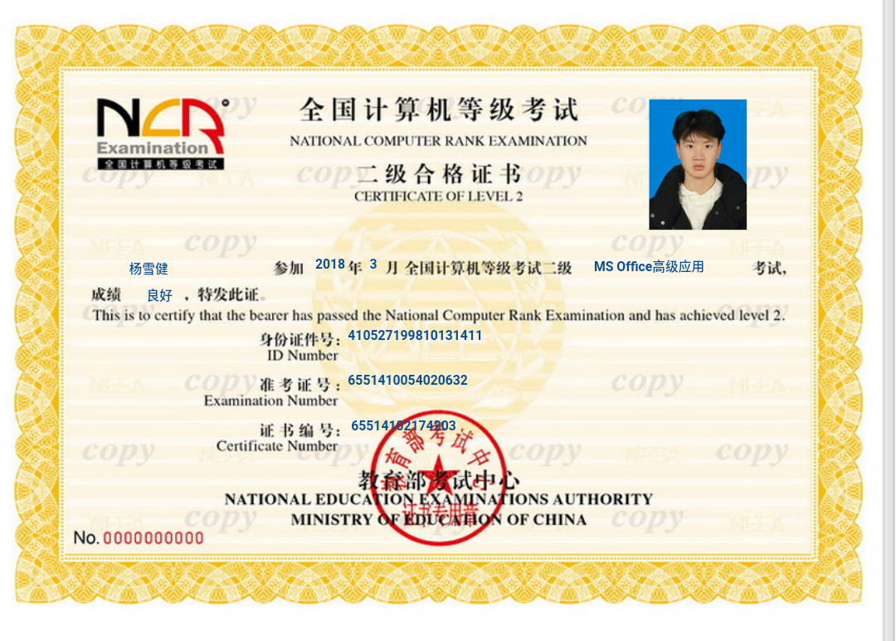
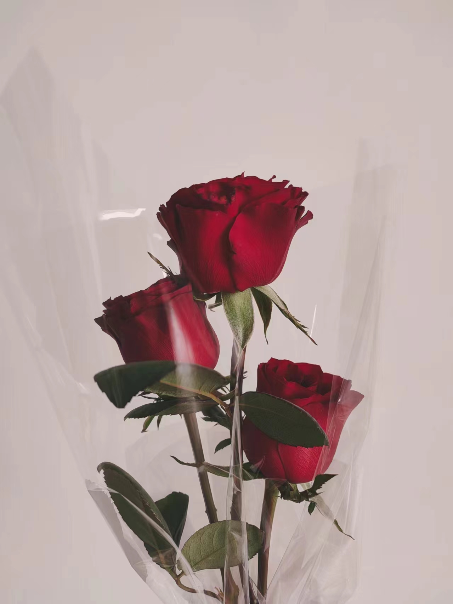
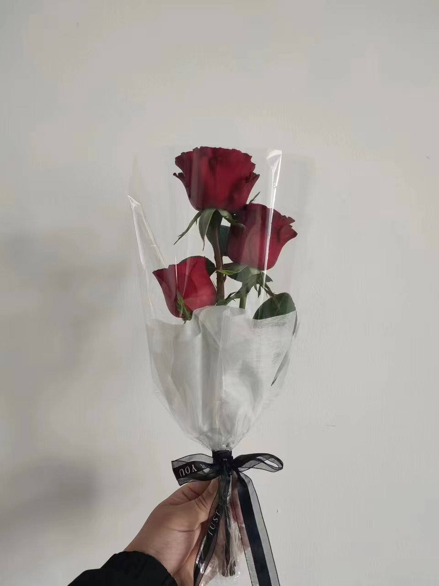
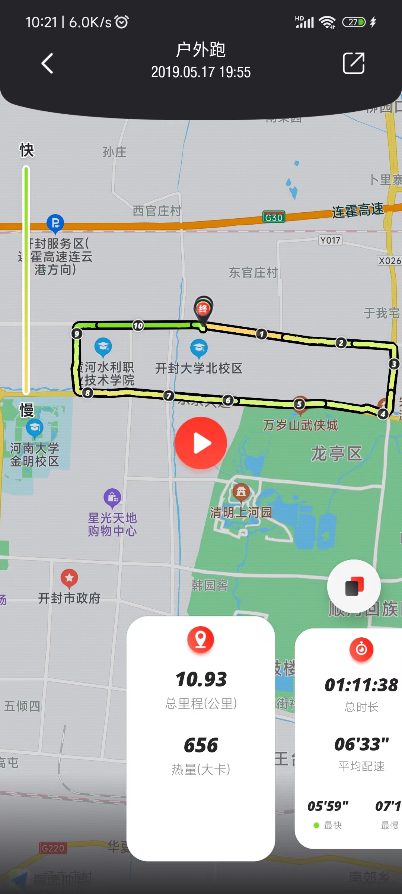
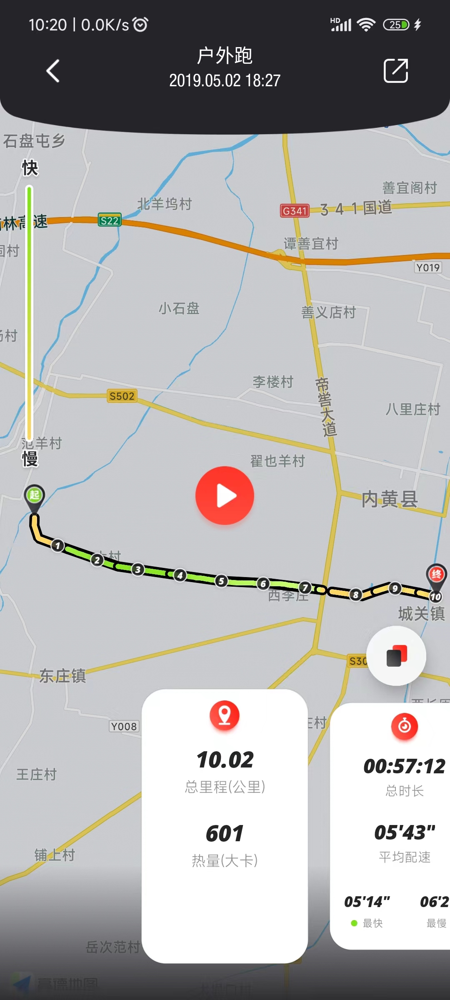
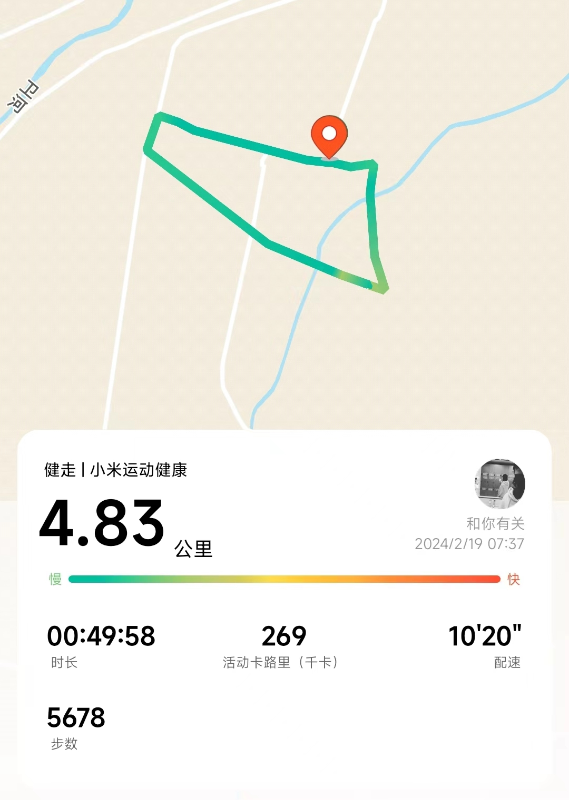
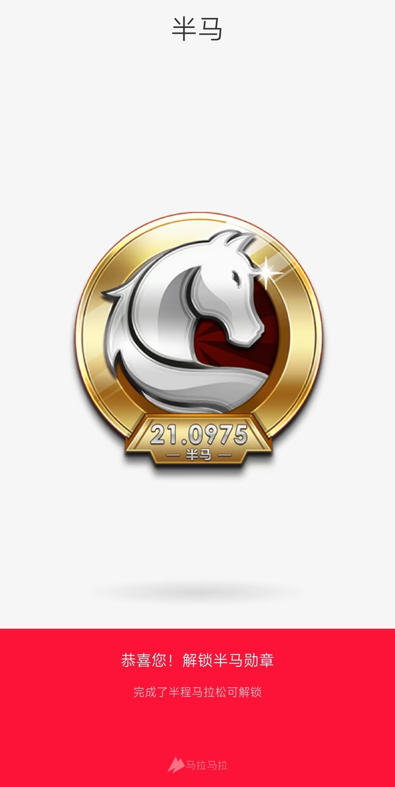
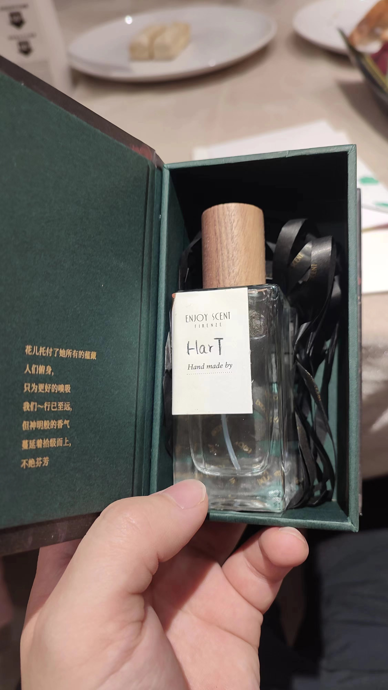

## 1、计算机二级
考试时砰砰的心跳声~  最终拿下！

## 2、花艺师
不枉费我在花店干这么久，还卖过花

第一束花：《First love》

## 3、绕学校、从村到县跑步。绕村健走

## 4、半程马拉松
很简单，跑就完事了

## 5、调香师
第一瓶香水：《Hart》

## 6、调酒师
第一杯酒：《大都会》

- 伏特加45ml
- 君度利口酒(橘味)15ml
- 青柠汁20ml
- 蔓越莓汁20ml
- 些许冰块, 摇酒完成并倒入杯子, 加上橙皮点缀

## 7、i can fly
被天空和大地包裹的感觉真爽！

